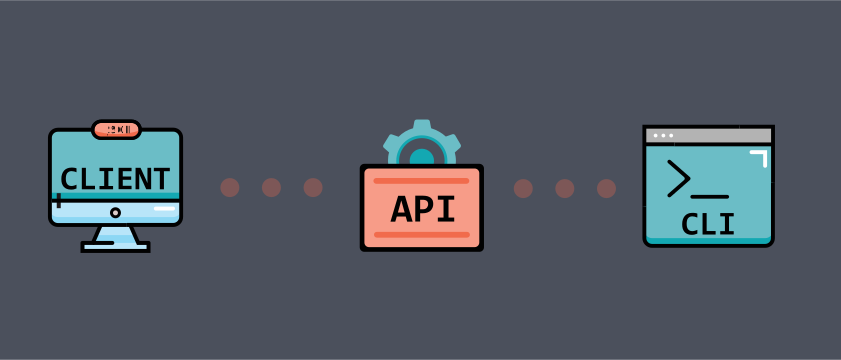

<div align="center">

# OpenAPI Generator API


[](./LICENSE)

</br>

This is an API Wrapper Container for the [OpenAPI Generator CLI](https://github.com/OpenAPITools/openapi-generator-cli).

Contrary to [OpenAPI Generator Online](https://github.com/OpenAPITools/openapi-generator-online), it is easily customizable and exposes the entirety of the CLI through REST methods.



You can access a SwaggerUI documentation version when you start the server under `<domain>:<port>/api`.

Online API documentation is [availble on Apiary](https://openapigeneratorapi.docs.apiary.io/).

</div>
</br>

# About

This application is meant to serve as a dockerized API wrapper for [OpenAPI Generator CLI](https://github.com/OpenAPITools/openapi-generator-cli), exposing all of it's functionality, including options, through a REST API. It grants full CLI converage, including the ability to provide custom templates, and plugins (WIP).

For online API documentation, with a mock and live server integration, [please visit Apiary](https://openapigeneratorapi.docs.apiary.io/).

</br>
</br>

# Environment Variables
All current schemas defining the environment variables used in this application can be found in [`src/configuration`](/src/configuration).

Here you can find a list of them with descriptions:
```env
ENVIRONMENT - (Required) - The environment to use (development / production).
APP_PORT - (Required) - On which port should the server run?

GENERATOR_TEMPLATES_DIR - (Optional) - The directory where the generator templates are to be read from.
GENERATOR_OUTPUT_DIR - (Optional) - The directory where the generator should store generated files.
GENERATOR_TMP_DIR - (Optional) - The directory where the generator should store temporary files.

SWAGGER_TITLE - (Optional) - The title of the Swagger UI.
SWAGGER_DESCRIPTION - (Optional) - The description of the Swagger UI.
SWAGGER_VERSION - (Optional) - The version of Swagger (OpenAPI) spec.
OPENAPI_SCHEMA_FILE_PATH - (Optional) - Where should the OpenAPI self-schema be stored?
```

</br>

# Usage
This container is available publicly on DockerHub, under [`greenchill/openapi-generator-api`](https://hub.docker.com/repository/docker/greenchill/openapi-generator-api).

You can run it with Docker using the following command:
```bash
docker run greenchill/openapi-generator-api -e ENVIRONMENT=production -e APP_PORT=5000
```

The server produces JSON logs (in production mode), making them easy for ingestion and further processing.

Pre-configured Kubernetes deployment definitions will be available soon.

</br>

# Development
There is a pre-configured `.env` file present in the repo with a development configuration.

For development purposes, you can start the pre-configured `docker-compose.yml` with:
```bash
docker compose up

OR

yarn run docker:run
```

If you want to rebuild and run the container (especially after installing new dependencies), you can use:
```bash
docker compose up -V --build

OR

yarn run docker:run-rebuild
```

Development build features host server reloading, debugger-ready configuration and automatic regeneration of the OpenAPI spec (present in this repo as `oas3.yaml`, and linked with [Apiary](https://openapigeneratorapi.docs.apiary.io/)).

[Eslint](https://eslint.org/) for Typescript is also configured in this repository.

This project is built on top of [NestJS](https://nestjs.com/) and [Express](https://expressjs.com/). For general code workflow and library documentation, please refer to the [NestJS documentation](https://docs.nestjs.com/). For everything else, please follow the style and organization of the code itself.